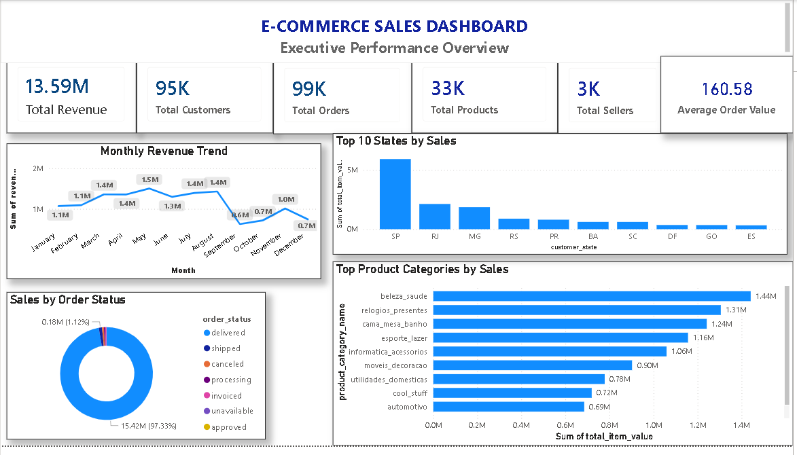

# 🛒 Olist E-Commerce Customer Analytics

> End-to-end e-commerce analytics project using PostgreSQL and Power BI to transform raw Olist marketplace data into a structured analytical warehouse and an executive sales dashboard.

---

## 📌 Project Overview

This project analyzes the **Brazilian Olist e-commerce marketplace dataset** to understand sales performance, customers, products, sellers, payments, reviews, and order behavior.

The project follows an end-to-end analytics workflow:

**Raw Data → Staging → Data Warehouse → Data Quality Checks → SQL Analytics → Power BI Dashboard**

The primary objective is to build a reliable analytical data model and convert transactional e-commerce data into meaningful business insights through an interactive Power BI dashboard.

---

## 🎯 Business Objectives

The project focuses on answering important business questions such as:

- How much revenue has the marketplace generated?
- How many customers and orders does the business have?
- What is the average order value?
- Which product categories generate the highest sales?
- Which Brazilian states generate the most sales?
- What is the distribution of orders by status?
- How does revenue change over time?
- How many products and sellers are present on the platform?
- What can overall sales performance tell us about the marketplace?

---

## 🏗️ Project Architecture

```text
                    ┌─────────────────────┐
                    │   Olist CSV Data    │
                    │     Raw Dataset     │
                    └──────────┬──────────┘
                               │
                               ▼
                    ┌─────────────────────┐
                    │       STAGING       │
                    │   Raw Data Tables   │
                    └──────────┬──────────┘
                               │
                               ▼
                    ┌─────────────────────┐
                    │     WAREHOUSE       │
                    │ Dimension + Fact    │
                    │      Tables         │
                    └──────────┬──────────┘
                               │
                               ▼
                    ┌─────────────────────┐
                    │   Data Quality      │
                    │      Checks         │
                    └──────────┬──────────┘
                               │
                               ▼
                    ┌─────────────────────┐
                    │   SQL Analytics     │
                    │ Business Metrics    │
                    └──────────┬──────────┘
                               │
                               ▼
                    ┌─────────────────────┐
                    │      Power BI       │
                    │ Executive Dashboard │
                    └─────────────────────┘
📂 Project Structure
ecommerce-sales-customer-analytics/
│
├── data/
│   └── raw/
│       ├── customers.csv
│       ├── orders.csv
│       ├── order_items.csv
│       ├── order_payments.csv
│       ├── order_reviews.csv
│       ├── products.csv
│       ├── sellers.csv
│       └── product_category_name_translation.csv
│
├── sql/
│   ├── staging/
│   │   └── staging_tables.sql
│   │
│   ├── warehouse/
│   │   ├── warehouse_tables.sql
│   │   └── load_warehouse.sql
│   │
│   └── data_quality/
│       └── warehouse_data_quality_checks.sql
│
├── powerbi/
│   └── ecommerce_sales_dashboard.pbix
│
├── screenshots/
│   └── dashboard.png
│
├── README.md
└── .gitignore

Folder and file names may vary slightly depending on the final repository structure.

🗃️ Dataset

This project uses the Brazilian E-Commerce Public Dataset by Olist.

The dataset contains information about:

Customers
Orders
Order items
Payments
Reviews
Products
Sellers
Product categories

The data allows analysis of the complete order lifecycle, from purchase through delivery and review.

🛠️ Technologies Used
Technology	Purpose
PostgreSQL	Database and data warehousing
SQL	Data loading, validation, transformation and analytics
Power BI	Interactive dashboard and visualization
DAX	Business metrics and measures
Git & GitHub	Version control and project management
CSV	Source data format
🏛️ Data Warehouse Design

The project uses a structured warehouse model containing dimension and fact tables.

Dimension Tables
dim_customers

Contains customer-level information.

Key attributes include:

customer_id
customer_unique_id
customer_zip_code_prefix
customer_city
customer_state
dim_products

Contains product information.

Key attributes include:

product_id
product_category_name
product_weight_g
product_length_cm
product_height_cm
product_width_cm
dim_sellers

Contains seller information.

Key attributes include:

seller_id
seller_zip_code_prefix
seller_city
seller_state
dim_product_category

Contains product category information and English category translations.

📊 Fact Tables
fact_orders

Stores order-level information such as:

Order ID
Customer ID
Order status
Purchase timestamp
Approval timestamp
Carrier delivery date
Customer delivery date
Estimated delivery date
fact_order_items

Stores individual products included in orders.

Includes:

Order ID
Order item ID
Product ID
Seller ID
Price
Freight value
Shipping limit date
fact_order_payments

Contains payment information including:

Payment type
Payment installments
Payment value
Payment sequence
fact_order_reviews

Contains customer review information including:

Review ID
Order ID
Review score
Review comments
Review creation date
Review answer timestamp
🔄 ETL / Data Pipeline

The project follows a simple warehouse loading process.

1. Extract

Raw Olist CSV files are loaded into PostgreSQL staging tables.

CSV Files
   ↓
PostgreSQL Staging
2. Load

Data is loaded from staging tables into warehouse dimension and fact tables.

Staging Tables
      ↓
Warehouse Tables
3. Validate

The warehouse data is checked for:

Row counts
Duplicate records
NULL values
Orphan records
Invalid review scores
Negative prices
Negative freight values
Negative payment values
4. Analyze

SQL queries and Power BI measures are used to calculate business metrics and identify trends.

🧪 Data Quality Checks

Several validation checks were performed before building the dashboard.

Row Count Validation

The number of records in warehouse tables was checked to ensure that data was successfully loaded.

Duplicate Checks

Duplicate checks were performed on important identifiers such as:

Customer ID
Product ID
Seller ID
Order ID
NULL Validation

Important fields were checked for NULL values.

Referential Integrity

Relationships between fact and dimension tables were validated.

Examples:

Orders → Customers
Order Items → Products
Order Items → Sellers
Payments → Orders
Reviews → Orders
Review Score Validation

Review scores were validated to ensure they fall within the expected range:

1 ≤ Review Score ≤ 5
Financial Validation

The project checks for invalid negative values in:

Product price
Freight value
Payment value
📈 Power BI Dashboard

The final Power BI dashboard provides an executive-level overview of e-commerce performance.

Dashboard Title

E-COMMERCE SALES DASHBOARD

Subtitle

Executive Performance Overview

💡 Key Performance Indicators

The dashboard contains six primary KPIs:

💰 Total Revenue

Measures the overall sales/revenue generated from order items.

👥 Total Customers

Measures the number of customers represented in the dataset.

🛒 Total Orders

Measures the total number of orders.

📦 Total Products

Measures the number of products available in the dataset.

🏪 Total Sellers

Measures the number of sellers.

📊 Average Order Value

Measures the average monetary value of an order.

📊 Dashboard Visualizations
1. Monthly Revenue Trend

A line chart showing how revenue changes throughout the year.

Business question:

How does revenue change month by month?

This helps identify:

High-revenue months
Low-revenue months
Overall revenue patterns
Seasonal behavior
2. Top Product Categories by Sales

A horizontal bar chart showing the highest-selling product categories.

Business question:

Which product categories generate the most sales?

This can help identify high-performing product segments.

3. Top 10 States by Sales

A column chart ranking Brazilian states according to sales.

Business question:

Which geographic markets generate the most sales?

This provides a geographical view of marketplace performance.

4. Sales by Order Status

A donut chart showing the distribution of orders by status.

Examples include:

Delivered
Shipped
Canceled
Unavailable
Processing

Business question:

What is the distribution of orders across different order statuses?

🎨 Dashboard Design

The dashboard follows a clean executive-style design.

Design principles
Consistent blue color theme
Dark blue KPI values
Neutral labels
Clear visual hierarchy
Consistent card sizing
Consistent spacing
Minimal visual clutter
Business-focused chart titles
Easy-to-read labels

The layout follows:

                 Dashboard Title
              Executive Subtitle

      KPI   KPI   KPI   KPI   KPI   KPI

       Monthly Revenue | Product Categories

       Order Status    | Top 10 States
📐 Analytical Metrics

Important metrics used in the dashboard include:

Total Revenue
Total Revenue = SUM(Order Item Price)
Average Order Value

Conceptually:

Average Order Value =
Total Revenue / Total Orders

The exact implementation depends on the DAX measure used in the Power BI model.

🔍 Example Business Insights

The dashboard enables analysis such as:

Revenue Performance

Monthly revenue trends can be analyzed to determine periods of stronger and weaker sales performance.

Product Performance

Top product categories can be compared to identify categories contributing most to sales.

Geographic Performance

Top-performing Brazilian states can be identified to understand regional demand.

Order Performance

Order status distribution provides an overview of completed, pending, canceled, and other order states.

Customer Value

Average Order Value provides an indication of the typical monetary value associated with an order.

🚀 How to Run the Project
Prerequisites

Install:

PostgreSQL
Power BI Desktop

Git

1. Clone the Repository
git clone <https://github.com/Yeshwanthreddy7/ecommerce-sales-customer-analytics-uykr>


Navigate to the project:

cd ecommerce-sales-customer-analytics
2. Create the PostgreSQL Database

Create a PostgreSQL database for the project.

Example:

CREATE DATABASE ecommerce_analytics;

Connect to the database and create the required schemas:

CREATE SCHEMA staging;
CREATE SCHEMA warehouse;

3. Load the Raw Data

Load the Olist CSV files into the appropriate staging tables.

The staging tables represent the raw source data.

4. Create Warehouse Tables

Run the warehouse table creation SQL scripts.

The warehouse consists of:

Dimensions
├── dim_customers
├── dim_products
├── dim_sellers
└── dim_product_category

Facts
├── fact_orders
├── fact_order_items
├── fact_order_payments
└── fact_order_reviews

5. Load Warehouse Data

Execute the warehouse loading scripts to transfer data from:

staging → warehouse

6. Run Data Quality Checks

Execute the data quality SQL scripts.

Verify:

Row counts
Duplicates
NULL values
Orphan records
Invalid review scores
Negative financial values

Only after validation should the data be used for dashboard analysis.

7. Open Power BI

Open:  powerbi/ecommerce_sales_dashboard.pbix
Screenshot : 

Configure the PostgreSQL connection if required.

Refresh the dataset.

📸 Dashboard Preview

Example Markdown:


📁 Project Workflow

The complete workflow can be summarized as:

Raw Olist Dataset
       │
       ▼
CSV Files
       │
       ▼
Staging Tables
       │
       ▼
Data Warehouse
       │
       ├── Customer Dimension
       ├── Product Dimension
       ├── Seller Dimension
       ├── Category Dimension
       │
       ├── Orders Fact
       ├── Order Items Fact
       ├── Payments Fact
       └── Reviews Fact
       │
       ▼
Data Quality Validation
       │
       ▼
Business Metrics
       │
       ▼
Power BI
       │
       ▼
Executive Sales Dashboard


🎓 What I Learned

This project provided practical experience with:

Relational database design
PostgreSQL
SQL querying
Data warehousing concepts
Fact and dimension modeling
ETL/ELT workflows
Data quality validation
Referential integrity
Business KPI development
DAX measures
Power BI dashboard development
Data visualization
Git and GitHub
End-to-end analytics project development


🔮 Future Improvements

Potential future enhancements include:

Customer segmentation
Customer lifetime value analysis
Repeat customer analysis
Seller performance analysis
Delivery-time analysis
Review sentiment analysis
Product profitability analysis
Cohort analysis
RFM customer segmentation
Automated ETL pipelines
Scheduled Power BI refresh
Advanced forecasting
Additional geographic analysis


📌 Project Status

Status: Completed ✅

The project currently includes:

✅ Raw Olist dataset
✅ PostgreSQL staging layer
✅ PostgreSQL warehouse
✅ Dimension tables
✅ Fact tables
✅ Data quality validation
✅ SQL analytics
✅ DAX measures
✅ Power BI dashboard
✅ Executive KPI section
✅ Sales trend analysis
✅ Product category analysis
✅ Geographic sales analysis
✅ Order status analysis